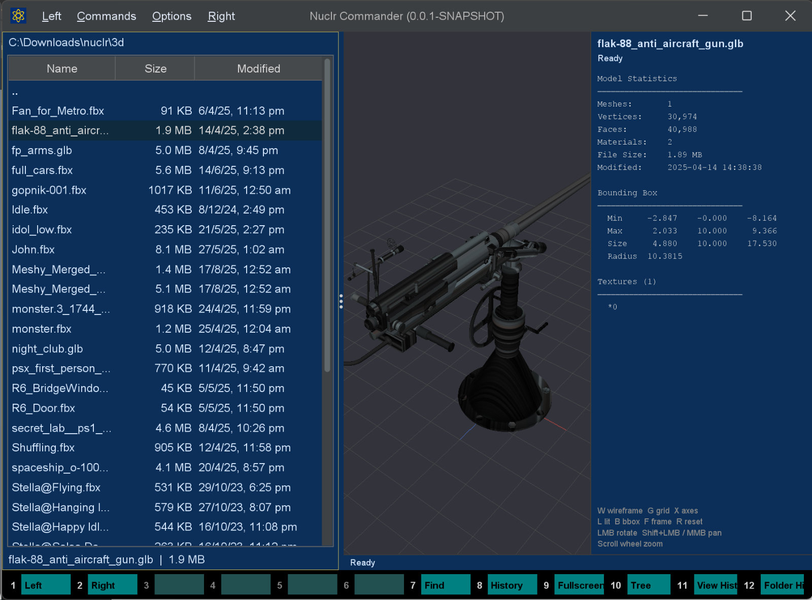
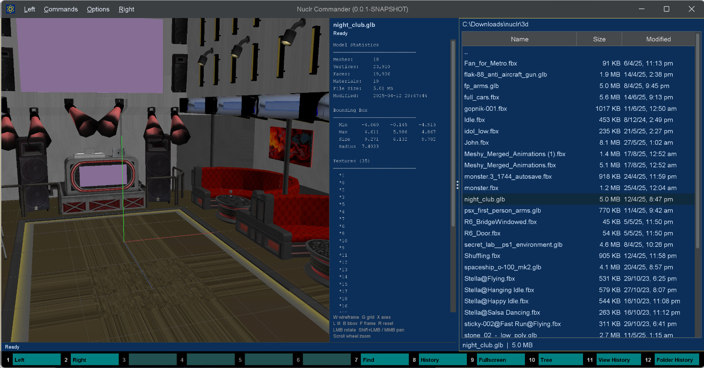

# 🧊 3D Model Quick Viewer

A [Nuclr Commander](https://nuclr.dev) plugin for quick, read-only inspection of 3D model files in the Quick View pane. It renders model stats, bounding-box data, texture references, and import warnings using [LWJGL Assimp](https://www.lwjgl.org/), with no external tools or network access required.




## ✨ What it shows

| Section | Details |
|---|---|
| 📊 Model Statistics | Mesh count, vertex count, triangle face count, material count, file size, last-modified timestamp |
| 📦 Bounding Box | Per-axis Min / Max / Size values computed from model vertices |
| 🖼️ Textures | Deduplicated texture paths collected across all materials |
| ⚠️ Warnings | Import failures, file-size limits, native-library availability issues |

## 🧩 Supported formats

Assimp supports [many 3D formats](https://assimp.org/index.php/downloads). This plugin activates for these extensions by default:

| Extension | Format |
|---|---|
| `.fbx` | Autodesk FBX |
| `.obj` | Wavefront OBJ |
| `.gltf` / `.glb` | glTF 2.0 |
| `.dae` | Collada |
| `.3ds` | Autodesk 3DS Max |
| `.ply` | Stanford PLY |
| `.stl` | Stereolithography |

## 📥 Installation

Copy the signed plugin archive and detached signature into the Nuclr Commander `plugins/` directory:

```text
quick-view-3d-1.0.0.zip
quick-view-3d-1.0.0.zip.sig
```

Nuclr Commander verifies the RSA-SHA256 signature against `nuclr-cert.pem` on load. The plugin becomes available immediately without a restart.

> 🔧 LWJGL extracts the required Assimp native library (`.dll`, `.so`, or `.dylib`) from bundled JARs into the system temp directory on first use. If extraction fails, the panel shows a readable error instead of crashing.

## 🛠️ Building

Prerequisites: `Java 21+`, `Maven 3.9+`, and a locally installed `plugins-sdk` (`mvn install` in `plugins-sdk/`).

```bash
# Compile, test, package, and sign
mvn clean verify -Djarsigner.storepass=<keystore-password>

# Artifacts in target/
#   quick-view-3d-1.0.0.zip
#   quick-view-3d-1.0.0.zip.sig
```

The signing step expects the keystore at `C:/nuclr/key/nuclr-signing.p12` with alias `nuclr`.

### 🚀 Quick deploy

```bat
deploy.bat
```

This runs `mvn clean verify` and copies both artifacts into `C:\nuclr\sources\commander\plugins\`.

## ⚙️ How it works

### Assimp import

The file is parsed with these post-processing flags:

| Flag | Effect |
|---|---|
| `aiProcess_Triangulate` | Converts polygons to triangles so reported face counts are consistent |
| `aiProcess_JoinIdenticalVertices` | Deduplicates vertices before statistics are calculated |
| `aiProcess_SortByPType` | Separates primitive types for more reliable mesh data |

### Statistics extraction

- 📈 Mesh, vertex, and face totals are accumulated across all imported meshes.
- 📦 Bounding-box values are computed by iterating through model vertices.
- 🖼️ Texture references are collected from every material and deduplicated in insertion order.

### Safety limits

| Guard | Limit |
|---|---|
| Maximum file size | `250 MB` - larger files show a warning and are not passed to Assimp |
| Maximum mesh count for bounding box | `10,000` - counts are still shown, but AABB calculation is skipped |
| Native library unavailable | The panel shows a friendly error and avoids crashing the host |

### Async loading

All I/O and Assimp work runs on a virtual thread (`Thread.ofVirtual()`). The Swing EDT stays responsive, the panel shows a loading state immediately, and a generation counter prevents stale results when users switch files quickly.

`aiReleaseImport` is always called in a `finally` block so native scene memory is released even if parsing fails.

## 📄 Plugin manifest

```json
{
  "id": "dev.nuclr.plugin.core.quickviewer.3d",
  "name": "3D Model Quick Viewer",
  "version": "1.0.0",
  "type": "Official",
  "quickViewProviders": [
    "dev.nuclr.plugin.core.assimp.AssimpModelQuickViewProvider"
  ]
}
```

## 🗂️ Source layout

```text
src/
|-- main/java/dev/nuclr/plugin/core/assimp/
|   |-- AssimpModelQuickViewProvider.java  # QuickViewProvider entry point
|   |-- AssimpModelPanel.java              # Swing UI panel + async load logic
|   `-- ModelStats.java                   # Parsed statistics DTO
`-- main/resources/
    `-- plugin.json
```

## 📚 Dependencies

| Library | Version | Purpose |
|---|---|---|
| `org.lwjgl:lwjgl` | `3.3.4` | LWJGL core runtime |
| `org.lwjgl:lwjgl-assimp` | `3.3.4` | Assimp Java bindings |
| LWJGL natives | `3.3.4` | Native binaries for Windows x64, Linux x64, macOS x64, macOS ARM64 |
| `dev.nuclr:plugins-sdk` | `1.0.0` | Nuclr plugin interfaces |

## 📜 License

Apache License 2.0 - see [LICENSE](LICENSE).
