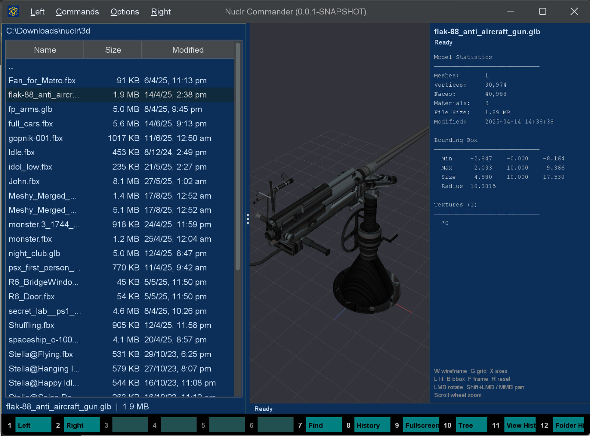
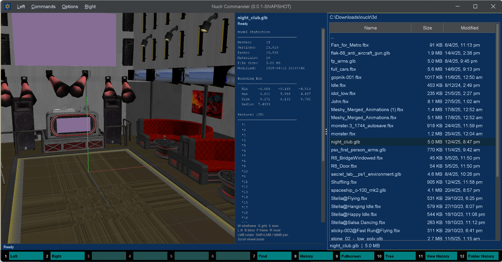

# 🧊 3D Model Quick Viewer

A [Nuclr Commander](https://nuclr.dev) plugin for quick, read-only inspection of 3D model files in the Quick View pane. It renders an interactive OpenGL viewport alongside model statistics, bounding-box data, texture references, and import warnings using [LWJGL](https://www.lwjgl.org/) (Assimp + OpenGL), with no network access required.

Everything Assimp reads works out of the box. If [Blender](https://www.blender.org/) happens to be installed, the plugin also previews `.blend`, USD and Alembic files by converting them in the background — see [Blender formats](#-blender-formats).




## ✨ What it shows

| Section | Details |
|---|---|
| 🖥️ 3D Viewport | Interactive OpenGL render with orbit/pan/zoom, wireframe, grid, axes, bounding box, and lit/unlit shading |
| 📊 Model Statistics | Mesh count, vertex count, triangle face count, material count, file size, last-modified timestamp |
| 📦 Bounding Box | Per-axis Min / Max / Size values computed from model vertices, plus bounding sphere radius |
| 🖼️ Textures | Deduplicated texture paths collected across all materials |
| ⚠️ Warnings | Import failures, file-size limits, vertex/index limits, native-library availability issues |

### 🎮 Viewport controls

| Input | Action |
|---|---|
| Left mouse drag | Orbit camera |
| Shift + left drag / middle drag | Pan |
| Scroll wheel | Zoom |
| `W` | Toggle wireframe |
| `G` | Toggle grid |
| `X` | Toggle axes |
| `L` | Toggle lit / unlit shading |
| `B` | Toggle bounding box |
| `F` | Frame model |
| `R` | Reset camera |

> 💡 The viewport must have focus (click it first) for keyboard shortcuts to work.

## 🧩 Supported formats

Assimp supports [many 3D formats](https://assimp.org/index.php/downloads). This plugin activates for these extensions by default:

| Extension | Format |
|---|---|
| `.fbx` | Autodesk FBX |
| `.obj` | Wavefront OBJ |
| `.gltf` / `.glb` | glTF 2.0 |
| `.dae` | Collada |
| `.3ds` | Autodesk 3DS Max |
| `.ply` | Stanford PLY |
| `.stl` | Stereolithography |

## 🧅 Blender formats

Assimp cannot read these at all, so the plugin hands them to a locally installed Blender, which converts them to a self-contained glTF that the ordinary import path then reads:

| Extension | Format |
|---|---|
| `.blend` | Blender scene |
| `.usd` / `.usda` / `.usdc` / `.usdz` | Universal Scene Description |
| `.abc` | Alembic |

Blender is **never bundled** — it is used if present and the feature stays off if it is not, in which case these extensions fall through to whichever other viewer claims them. Blender 3.0 or newer is required.

**Detection** runs once in the background at plugin load, checking (in order) the `blenderExecutable` setting, the `NUCLR_BLENDER_PATH` and `BLENDER_PATH` environment variables, `PATH`, and the platform's usual install locations. A candidate only counts once it has actually answered `--version`, so an uninstall that left its folder behind is correctly ignored.

**Conversions are cached** in `~/.nuclr/cache/blender-glb`, keyed by the source path, size and timestamp together with the Blender and converter-script versions — so upgrading either retires stale entries automatically. The cache is trimmed to 250 entries / 2 GB, least-recently-used first. Set the `nuclr.blender.cache` system property to relocate it.

> 🔒 Blender runs with `--factory-startup` (the user's add-ons and preferences cannot change the result) and `--disable-autoexec` (a `.blend` cannot execute the Python drivers it may carry). Previewing a file never runs that file's code.

| Setting | Default | Purpose |
|---|---|---|
| `blenderExecutable` | auto-detected | Path to a Blender binary, when detection does not find the one you want |
| `blenderTimeoutSeconds` | `180` | Conversion timeout; the process is killed past it |

A first conversion costs a couple of seconds for a small scene, so the panel reports its progress while Blender works. Moving the selection away kills the process rather than letting it run to completion.

## 📥 Installation

Copy the signed plugin archive and detached signature into the Nuclr Commander `plugins/` directory:

```text
quick-view-3d-<version>.zip
quick-view-3d-<version>.zip.sig
```

Nuclr Commander verifies the RSA-SHA256 signature against `nuclr-cert.pem` on load. The plugin becomes available immediately without a restart.

> 🔧 LWJGL extracts the required native libraries (`.dll`, `.so`, or `.dylib`) from bundled JARs into the system temp directory on first use. If extraction fails, the panel shows a readable error instead of crashing. If OpenGL initialisation fails, the panel falls back to metadata-only display.

## ⚙️ How it works

### Assimp import

The file is parsed with these post-processing flags:

| Flag | Effect |
|---|---|
| `aiProcess_Triangulate` | Converts polygons to triangles so reported face counts are consistent |
| `aiProcess_JoinIdenticalVertices` | Deduplicates vertices before statistics are calculated |
| `aiProcess_SortByPType` | Separates primitive types for more reliable mesh data |
| `aiProcess_GenSmoothNormals` | Generates smooth normals if none are present in the file |
| `aiProcess_PreTransformVertices` | Bakes node transforms into vertex data for correct rendering |

### 📈 Statistics extraction

- Mesh, vertex, and face totals are accumulated across all imported meshes.
- 📦 Bounding-box values are computed by iterating through model vertices; a bounding sphere radius is derived from the AABB.
- 🖼️ Texture references are collected from every material across all texture types and deduplicated in insertion order.

### 🗺️ Texture resolution

For external texture paths (common in FBX files), the plugin probes multiple candidate locations in order: the exact stored path, the filename next to the model file, common texture subfolders (`Textures/`, `textures/`, `Maps/`, `Material/`, etc.) under the model directory and up to two levels above it. Embedded textures (compressed or raw BGRA) are decoded directly from the Assimp scene.

### 🛡️ Safety limits

| Guard | Limit |
|---|---|
| Maximum file size | 250 MB — larger files show a warning and are not passed to Assimp |
| Maximum mesh count for bounding box / 3D view | 10,000 |
| Maximum total vertices | 5,000,000 |
| Maximum total indices | 15,000,000 |
| Maximum texture dimension | 4,096 × 4,096 (larger textures are down-scaled) |
| Native library unavailable | Panel shows a friendly error and avoids crashing the host |

### ⚡ Async loading

All I/O and Assimp work runs on a virtual thread (`Thread.ofVirtual()`). The Swing EDT stays responsive, the panel shows a loading state immediately, and a generation counter prevents stale results when users switch files quickly.

`aiReleaseImport` is always called in a `finally` block so native scene memory is released even if parsing fails.

## 🗂️ Source layout

```text
src/main/java/dev/nuclr/plugin/core/assimp/
├── AssimpModelQuickViewProvider.java   plugin entry point
├── AssimpModelPanel.java               Swing panel, async load logic, stats display
├── AssimpModelReader.java              Assimp import, mesh/texture/stats extraction
├── ModelStats.java                     statistics DTO
├── blender/
│   ├── BlenderBridge.java              facade: availability, cache orchestration
│   ├── BlenderLocator.java             finds and version-checks the executable
│   ├── BlenderConverter.java           runs one headless conversion
│   ├── BlenderScript.java              unpacks the converter script from the jar
│   ├── GlbCache.java                   LRU cache of converted GLBs
│   ├── ProcessRunner.java              bounded process execution with cancellation
│   ├── BlenderInstall.java             a verified executable and its version
│   ├── BlenderException.java           conversion failure, phrased for the panel
│   └── Digests.java                    short content hashes for cache keys
├── gl/
│   ├── ModelViewportCanvas.java        LWJGL3-AWT OpenGL canvas
│   ├── CameraOrbit.java                orbit/pan/zoom camera
│   ├── GlMesh.java                     VAO/VBO upload and draw
│   ├── GlTexture.java                  OpenGL texture upload
│   ├── GridRenderer.java               floor grid rendering
│   └── ShaderProgram.java              GLSL shader compilation and linking
└── model/
    ├── ModelData.java                  GPU-ready scene data passed to the viewport
    ├── MeshData.java                   per-mesh vertex/index/UV arrays
    └── TextureData.java                decoded RGBA pixel data

src/main/resources/blender/
└── nuclr_export_glb.py                 headless Blender → GLB converter script
```

## 📚 Dependencies

| Library | Version | Purpose |
|---|---|---|
| `org.lwjgl:lwjgl` | `3.3.5` | LWJGL core runtime |
| `org.lwjgl:lwjgl-assimp` | `3.3.5` | Assimp Java bindings |
| `org.lwjgl:lwjgl-opengl` | `3.3.5` | OpenGL Java bindings |
| `org.lwjgl:lwjgl-jawt` | `3.3.5` | AWT/Swing integration for LWJGL |
| `org.lwjglx:lwjgl3-awt` | `0.2.3` | AWTGLCanvas for embedding OpenGL in Swing |
| LWJGL natives | `3.3.5` | Native binaries for Windows x64, Linux x64, macOS x64, macOS ARM64 |
| `dev.nuclr:platform-sdk` | `3.0.1` | Nuclr platform interfaces |

## 📜 License

Apache License 2.0 — see [LICENSE](LICENSE).
